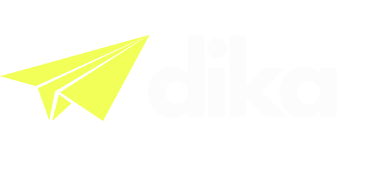
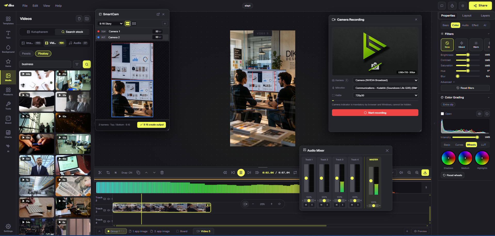
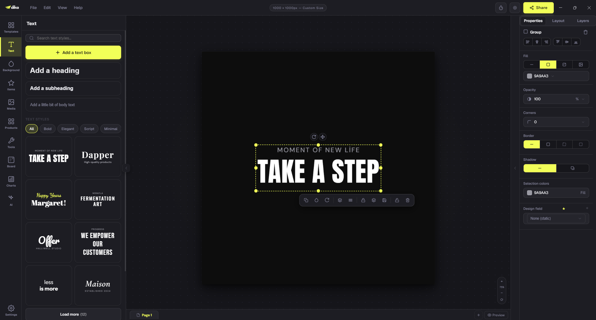

<table>
<tr>
<td width="190" align="center">

</td>
<td>

<h1 align="right">dika studio</h1>

<hr>

<h3 align="right">One editor. Every format. Your machine.</h3>

</td>
</tr>
</table>

[](LICENSE)
[](#local-by-design)
[](#download)
[](#run-it)

**dika studio Community Editor is a complete creative production environment for design and video.**
It brings visual design, motion, presentations, infinite canvas, whiteboards and a full video timeline
into one focused workspace. Open it, create, export. No cloud project or subscription required.

<table>
  <tr>
    <td width="58%"></td>
    <td width="42%"></td>
  </tr>
</table>

## One workspace for the whole creative process

Creative work rarely stays in one format. A campaign may begin on an infinite canvas, become a set
of social designs, grow into a presentation and finish as video. dika studio is built around that
reality: one editor, one project model and one set of precise creative tools from first idea to final
export.

### Design without boundaries

Build with text, shapes, images, freehand drawing, crop, masks, filters, effects and smart guides.
Create single-page designs, multi-page work, slide decks, infinite scenes and whiteboards without
switching products.

### Video inside the same editor

Move from canvas to timeline without rebuilding the work elsewhere. Arrange clips, graphics, text
and audio, then export H.264 MP4 directly in the browser through WebCodecs and mp4-muxer. No render
server or ffmpeg installation required.

### Local intelligence

Background removal, magic select, upscaling and Whisper subtitles run on your own machine. The
models work with the editor directly; your source image or audio is not uploaded for processing.

### Real project files, real output

Import and export PNG, JPG, PDF and SVG. Save editable structure as `.dika`, or package structure
and media together as `.dikapack` for backup and transfer.

## Community Editor and dika.studio

Community Editor is the full editing workspace: its canvas, timeline, project system, local AI and
export tools stand on their own.

[dika.studio](https://dika.studio) connects that editor to larger production workflows. It adds
managed generation, dubbing, translation, shared media and product libraries, comments, co-editing,
share links, social publishing and automation. These are service integrations for hosted compute,
teams and distribution—not creative tools removed from Community Editor.

Create independently here. Connect the same workflow to dika.studio when people, services and
publishing need to move together.

## Download

[](https://github.com/karamuhammet/Open-Editor-Dika-Studio-Community/releases/download/v1.0.0/dika.studio.Setup.1.0.0.exe)
[](https://github.com/karamuhammet/Open-Editor-Dika-Studio-Community/releases/download/v1.0.0/dika-studio-1.0.0-x64.tar.gz)

| | |
|---|---|
| **Windows** | [`dika.studio.Setup.1.0.0.exe`](https://github.com/karamuhammet/Open-Editor-Dika-Studio-Community/releases/download/v1.0.0/dika.studio.Setup.1.0.0.exe) — installs to `%LOCALAPPDATA%\Programs\dika.studio`, no admin rights needed |
| **Linux** | [`dika-studio-1.0.0-x64.tar.gz`](https://github.com/karamuhammet/Open-Editor-Dika-Studio-Community/releases/download/v1.0.0/dika-studio-1.0.0-x64.tar.gz) — extract and run `./dika-studio` |
| **Any browser** | Clone or download this repository and open `index.html` |

### Install from a terminal

**Windows PowerShell**

```powershell
$url = 'https://github.com/karamuhammet/Open-Editor-Dika-Studio-Community/releases/download/v1.0.0/dika.studio.Setup.1.0.0.exe'
Invoke-WebRequest -Uri $url -OutFile "$env:TEMP\dika.studio-setup.exe"
Start-Process "$env:TEMP\dika.studio-setup.exe"
```

**Linux**

```bash
curl -fL 'https://github.com/karamuhammet/Open-Editor-Dika-Studio-Community/releases/download/v1.0.0/dika-studio-1.0.0-x64.tar.gz' -o dika-studio.tar.gz
tar -xzf dika-studio.tar.gz
./dika-studio
```

Desktop build wraps the same editor in Electron and adds native Open / Save, an isolated data folder
and a local origin for on-device AI models. Windows build is currently unsigned, so SmartScreen may
show a first-run warning.

## Run it

Open `index.html`. The production bundle needs no build step, server or account. Projects save to
IndexedDB and return when the same page is opened in the same browser profile.

Fonts, the canvas, project storage and WebCodecs video export work directly from `file://`.

### Enable on-device AI in browser mode

Browsers do not allow a page opened from `file://` to read model files with `fetch`. Serve the folder
through any static server to enable cutout, magic select, upscale and Whisper subtitles:

```bash
node scripts/static-server.js 8300
```

Then open `http://localhost:8300/`. Desktop builds already provide the required local origin.

## Local by design

Your projects, media and version history stay on this computer. Editing, local AI and export do not
depend on cloud storage.

Community Editor uses a small set of network connections for account access, release metadata,
notices and services you explicitly request. None contains design content. Full details follow in
[Network activity](#network-activity).

## Project storage and backups

Browser mode stores projects, version history and media in IndexedDB under the current origin and
browser profile. Clearing site data, changing profiles or using a system cleanup tool can remove
that local storage.

Export important work as `.dikapack`. It is a portable ZIP containing both editable structure and
media, ready to archive or open on another machine.

The address bar identifies the open project with `?project=<id>`, so a bookmark can reopen it.

## Your API keys

Settings > API Keys supports Unsplash, Pexels, Pixabay, Freesound, Jamendo and GIPHY. Keys stay in
this browser and are sent only to their respective provider. Browser storage is not a secret vault;
use restricted keys with the lowest quota you need.

Managed generation uses your dika.studio workspace instead of storing provider credentials in this
local build.

## Network activity

Libraries and fonts ship in `vendor/`; the editor does not fetch them to draw the interface.

**Once a day, to `app.dika.studio`:**

```json
{ "installId": "<random>", "appVersion": "1.0.0", "edition": "community",
  "platform": "Win32", "locale": "en-GB", "sentAt": "<iso>", "accountId": "<only after sign-in>" }
```

`installId` is generated randomly on this machine. It is not derived from hardware, username or
network identity. This payload contains no document, project, file or media data. Current values are
visible in **Settings > Account**.

Community Edition has five built-in connection types:

- **Sign-in:** a code exchange with `app.dika.studio`. Credentials are entered in your browser, not
  inside Community Editor.
- **Daily beacon:** the payload shown above, sent to `app.dika.studio` at most once per day.
- **Notices:** current notices for AI and Products panels. Built-in notices remain available offline.
- **Update check:** release metadata from `app.dika.studio` when the app launches.
- **Update download:** an installer from `github.com`, only after you accept an update.

That is all five of them. Other providers are contacted only after a direct request:

- **Stock media:** a search goes to the selected provider, using your key.
- **Whisper model:** first subtitle use downloads the model from `huggingface.co` and caches it in
  the browser. Subtitles require WebGPU.

Sign-in is optional for local creation. It enables account-connected resources such as the online
template library.

## Signing out

Use **Settings > Account**. The session is cleared from this machine first; local projects remain
untouched.

Local pages opened through `file://` share browser-profile storage. Another local page in the same
profile could read that short-lived session. Desktop builds use isolated storage.

## Developing Community Editor

`index.dev.html` loads source modules separately so changes appear after reload. Run it through the
static server, then rebuild `index.html` after editing anything under `modules/`:

```bash
node tools/build-bundle.mjs
```

Before release, verify the Community Editor manifest:

```bash
node tools/check-upstream-drift.mjs
```

## Licence

Source is published under the [Business Source License 1.1](LICENSE). It is free to use and source
available.

You may, free of charge and including commercial use:

- run, modify and self-host it for your own use
- install it throughout your organisation
- produce designs, media and client work

**Work created with Community Editor belongs to its creator.** The licence places no conditions on
creative output.

You may not offer the software to third parties as a competing product or hosted service, embed it
in a product that performs substantially the same role as dika studio, or remove its identity and
redistribute it as your own. Refer to [LICENSE](LICENSE) for exact terms.

Four years after each version is published, that version automatically converts to AGPL-3.0 under
the licence terms.

Third-party components retain their own licences; see
[THIRD-PARTY-NOTICES.md](THIRD-PARTY-NOTICES.md). dika studio names, logos and marks are governed by
[TRADEMARK.md](TRADEMARK.md). Contributions require a CLA; see [CONTRIBUTING.md](CONTRIBUTING.md).

## Reporting something

Open a public repository issue for product bugs. Report security problems privately using the
instructions in [SECURITY.md](SECURITY.md).
